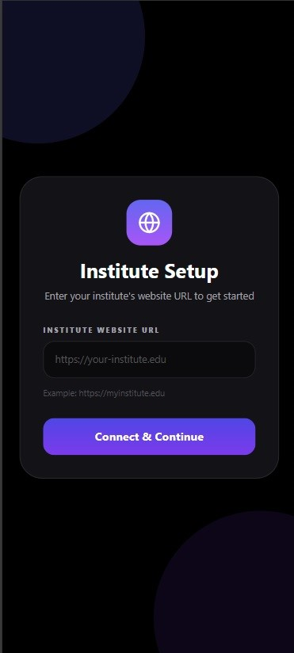
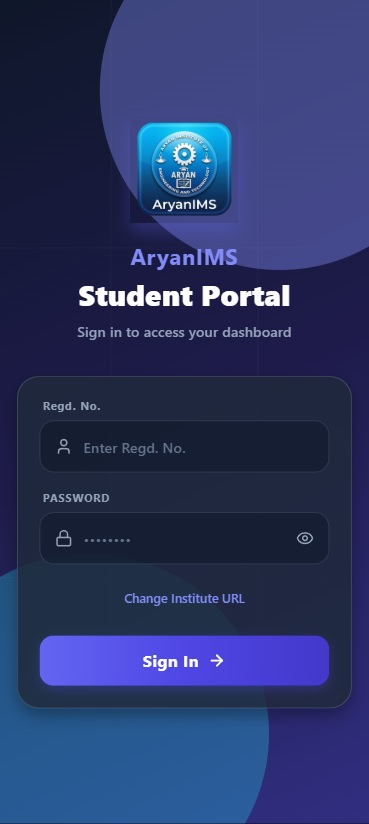
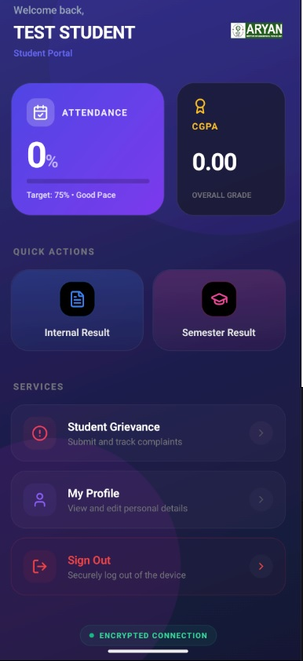
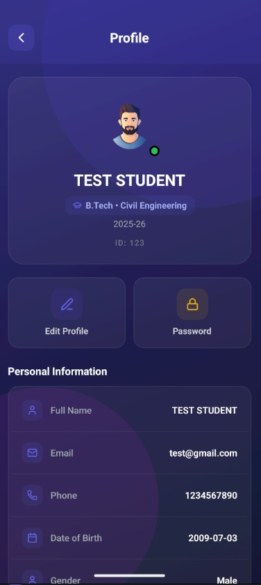

# AryanIMS - Student Mobile Application

AryanIMS is a premium, feature-rich mobile application designed for students to seamlessly access their academic information. Built with **React Native (Expo)** and powered by a robust **CodeIgniter 4** backend, it offers a modern, glassmorphism-inspired interface for an enhanced user experience.

## 🚀 Features

*   **🔐 Secure Authentication**: Token-based login (JWT) with secure session management and auto-logout functionality.
*   **📊 Interactive Dashboard**:
    *   Visual Bento-grid layout.
    *   Real-time **Attendance Tracking** with progress bars.
    *   Quick access to **CGPA** and academic stats.
*   **📜 Academic History**: View internal and semester results with detailed breakdowns.
*   **📢 Grievance Redressal**: Submit and track complaints/grievances directly from the app.
*   **👤 Profile Management**: View and edit personal details, styled with a modern profile view.
*   **🔄 In-App Auto-Updates**: Custom self-hosted update mechanism ensuring students always have the latest version without needing the Play Store.
*   **🎨 Premium UI/UX**: "Vibrant Glow" design system with fluid animations, gradients, and a dark-themed glassmorphism aesthetic.

## 🛠️ Tech Stack

*   **Frontend**: React Native, Expo, TypeScript
*   **Styling**: StyleSheet, Expo Linear Gradient, Lucide React Native Icons
*   **Backend**: CodeIgniter 4 (PHP), MySQL
*   **Authentication**: JWT (JSON Web Tokens)
*   **Build System**: OAS (Over-The-Air) & APK generation via Gradle

## 📸 Screenshots

| Institute | Login Screen | Dashboard | Profile |
|:---:|:---:|:---:|:---:|
|  |  |  |  |

**Prerequisites**:
*   Android Phone

## 📄 License

© 2026 **CodeCrazy Pvt. Ltd.** - All Rights Reserved.
* Designed & Developed by **Sipun Nayak**.
